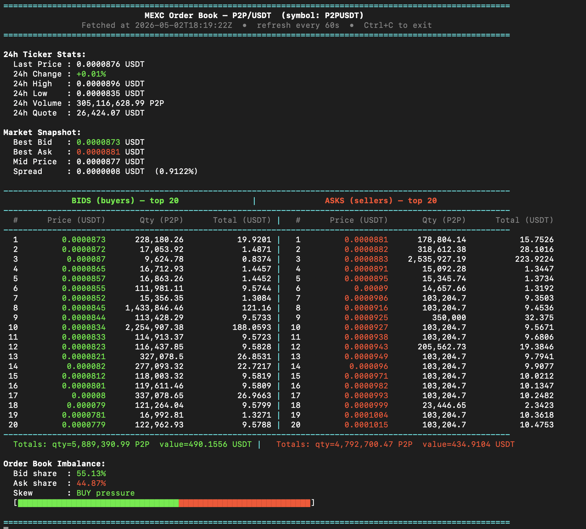

# NonKYC Order Book CLI

A simple Python command-line tool that fetches and displays the order book for any trading pair on the [NonKYC exchange](https://www.nonkyc.io/), with a side-by-side bid/ask view, 24h ticker stats, and optional auto-refresh.

## Features

- Side-by-side bid (green) and ask (red) columns
- 24h ticker stats: last price, change %, high, low, volume
- Market snapshot: best bid/ask, mid price, spread (absolute and %)
- Per-side totals (quantity and notional value)
- Order book imbalance with a visual buy/sell pressure bar
- Optional auto-refresh with screen clearing (`-t SECONDS`)
- Symbol validation with helpful "did you swap base/quote?" hints
- Color output that auto-disables when piping to a file
- No API key required (uses NonKYC public REST endpoints)

## Requirements

- Python 3.8+
- [`requests`](https://pypi.org/project/requests/)

## Installation

```
git clone https://github.com/freqnik/nonkyc-orderbook.git
cd nonkyc-orderbook
python3 -m venv venv
source venv/bin/activate
pip install -r requirements.txt
```

If you prefer not to use a requirements file:

```bash
pip install requests
```

## Usage

```bash
python nonkyc_orderbook.py <BASE> <QUOTE> [--depth N] [-t SECONDS]
```

### Arguments

| Argument          | Description                                            | Default  |
| ----------------- | ------------------------------------------------------ | -------- |
| `BASE`            | Base coin ticker (e.g. `BTC`)                          | required |
| `QUOTE`           | Quote coin ticker (e.g. `USDT`)                        | required |
| `--depth N`       | Number of levels per side (1–5000)                     | 20       |
| `-t`, `--refresh` | Auto-refresh interval in seconds (0 = single snapshot) | 0        |

### Examples

```bash
# One-shot snapshot
python nonkyc_orderbook.py BTC USDT

# Show 30 levels per side
python nonkyc_orderbook.py ARRR USDT --depth 30

# Live view that refreshes every 5 seconds
python mexc_orderbook.py XMR USDT -t 5

# Save a snapshot to a file (colors auto-stripped)
python mexc_orderbook.py BEAM USDT > snapshot.txt
```

Press `Ctrl+C` to exit when running in refresh mode.

## Screenshot



Note this a screenshot for my other repo mexc-orderbook. The NonKYC is the same format

# 

## Disclaimer

This tool is for informational purposes only. It is not affiliated with MEXC and provides no investment advice. Use at your own risk.

## License

[MIT](LICENSE)

# Buy me a coffee:

Donations help us provide more software for people like you! Crypto was made for supporting your developers.

### Bitcoin


```
bc1pxuw8nakll36829gd54veyu90ykh9jlrswjjxe9plcufjq8rgq3hqzrwdsd
```

### Monero


```
88XtF4MzPp4bdTxyYaa7TNhewDD1DELDS5qqyecrwZhvj7jPnyiDjLf1tNw9gqhTen9hv9fvZQJwsCzjxTPoj6266EbmrGR
```

### Pirate Chain


```
zs1cxyj35lfyvg66twsuf422ttptyqulhlftwfnap808ddeuqu32x0t4h5dxawqy7ar9jpuqhh293g
```

### Sentinel


```
sent1y98hv7sjcgf8ehtjdkgpt8vqq2qzx5wk56042h
```
